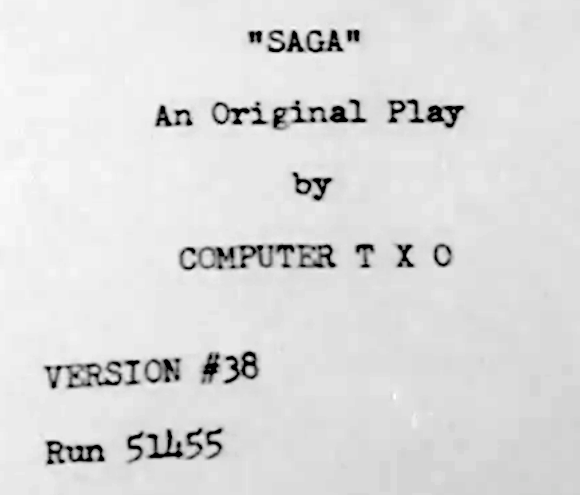
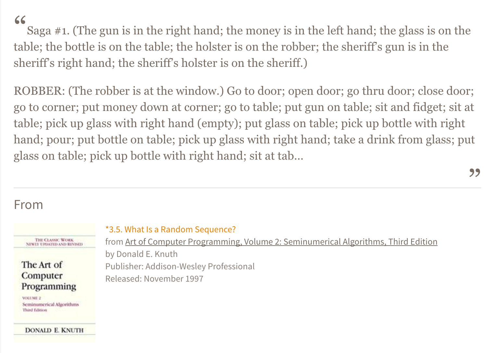
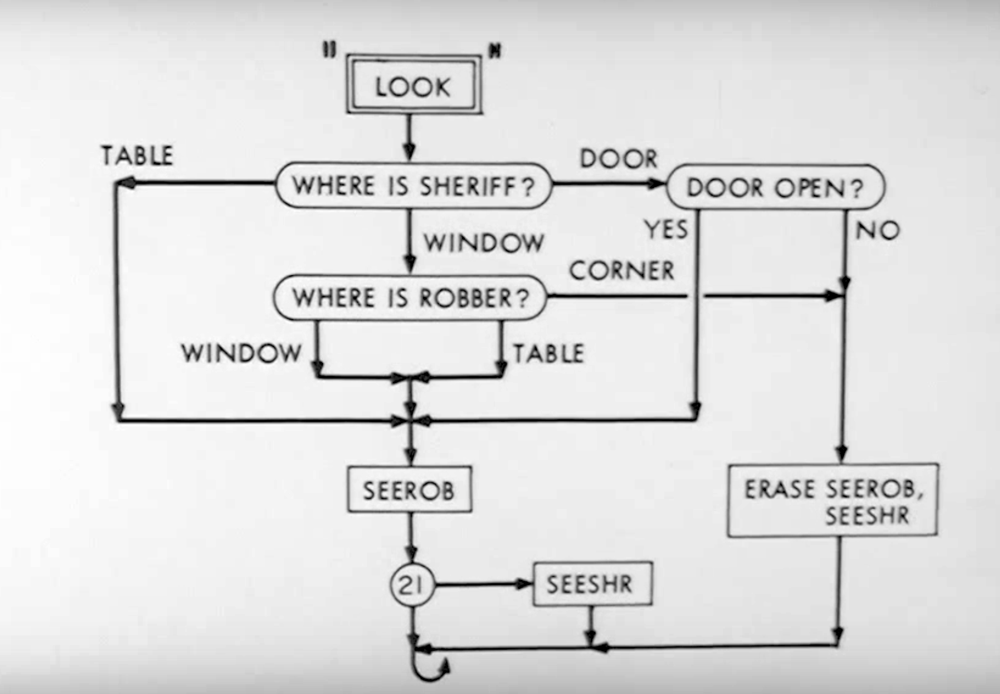

SAGA III: NaNoGenMo2015
=======================



Inspired by one of the earliest computer generated narratives: SAGA II, created by
Douglas T. Ross and Harrison R. Morse at MIT and featured on _The Thinking Machine_,
a 1962 television special co-produced by CBS and MIT. The entire hour-long
special can be <a href="http://video.mit.edu/watch/the-thinking-machine-1961-mit-centennial-film-6712/">viewed at MIT</a>.

I came upon the work the day before NaNoGenMo started (!) while taking Mark Sample's EdX course on <a href="https://www.edx.org/course/electronic-literature-davidsonx-d004x">Electronic Literature</a>, where it's mentioned in a lecture. Hooray!

Research
--------------

Source code for the original SAGA II seems to be lost, but in addition to the
footage of storyboards and captions from the television special, there are a few
other resources:

PDF scan of the <a href="http://bitsavers.trailing-edge.com/pdf/mit/tx-0/memos/Morse_SAGAII_Oct60.pdf">Preliminary Operating Notes for SAGA II</a>
includes examples of the branching and switching logic.

The Art of Computer Programming, Volume 2 by Donald Knuth contains two examples of
the original out. I used this as my reference implementation:


<a href="https://www.safaribooksonline.com/a/art-of-computer/514751/">First example</a> and <a href="https://www.safaribooksonline.com/a/art-of-computer/514752/">second example</a> [links are to the excerpts on <a href="https://www.safaribooksonline.com/">Safari</a>]

Implementation details
----------------



This deliberately doesn't try to mimic the original architecture, as that
would hardly make sense in a modern programming environment (and NaNoGenMo
is supposed to be fun). I did study all the exemplars I could find and
try to back-port the logic, including some pretty tedious manual
manipulation of objects.

The code is pure Python 3, no dependencies. In its default mode, it runs
through a single scene and outputs a simple text file mimicing the original
(line breaks shortened for brevity):

```
 The gun is in the robber's right hand. The money is in the robber's
 left hand. The holster is on the robber. The sheriff's gun is in the
  sheriff's right hand. The sheriff's holster is on the sheriff. The
          glass is on the table. The bottle is on the table.

                                ROBBER
      (The robber is at the window.) Open door; go through door;
  close door; go to corner; put money on corner; go to table; go to
 window; check gun; go to corner; go to table; pick up the glass with
   the robber's left hand; go to window; go to corner; count money

                               SHERIFF
               Go to window; open door; go through door

                                ROBBER
                         Fire; sheriff NICKED

                               SHERIFF
                           Close door; aim

                                ROBBER
                             Fire; MISSED

                               SHERIFF
                             Fire; MISSED

                                ROBBER
                         Fire; sheriff NICKED

                               SHERIFF
                       Aim; fire; robber NICKED

                                ROBBER
          Aim; fire; sheriff HIT; aim; fire; sheriff NICKED

                               SHERIFF
                            Sheriff dies.

                                ROBBER
   Blow out barrel; put gun in holster; pick up the money with the
 robber's right hand; go to table; open door; go through door; close
                                 door

                               CURTAIN
```

The Story
---------

In this, the Director's Cut, 349 scenes were restored to meet the 50,000 word rule. <a href="sage-3.txt">SAGA III: A teleplay in one act, 350 scenes and 53,392 words.</a>
